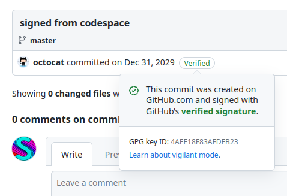
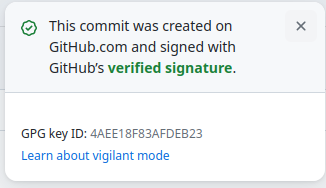

+++
date = "2023-11-11T23:00:00+00:00"
description = "Creating fake signed commits"
tags = ["github", "programming", "security"]
title = "Forging signed commits on GitHub"
+++

A half-year ago, I found a bug in an internal GitHub API that let me trick the internal API into signing commits as any user. So I could create a commit signed by a user I don't control:



Before I explain how I did that, first some context on how Git commit signing works:

## Git commit internals
Git commits are stored in a custom text-based format that looks like:
```
tree 55ca6286e3e4f4fba5d0448333fa99fc5a404a73
parent 7676f1f3b526f05b530a3566211dab5a5225af9a
author loops <me@iter.ca> 1678388328 -0500
committer loops <me@iter.ca> 1678388328 -0500

Commit message
```

Signed commits have a extra `gpgsig` header that has a signature over every line in the commit except the `gpgsig` itself:

```
tree be0788944df13c5d170e050f2fe178360c3df5a5
author loops <me@iter.ca> 1678388328 -0500
committer loops <me@iter.ca> 1678388328 -0500
gpgsig -----BEGIN PGP SIGNATURE-----
 
 iQIzBAABCgAdFiEEK6cyil0jdmW2bZPmDXSPTJUzsugFAmQKLGgACgkQDXSPTJUz
 [...]
 =756m
 -----END PGP SIGNATURE-----

Legitimate signed commit
```

When you create a commit on GitHub.com, it is signed with GitHub's [web flow GPG key](https://github.com/web-flow.gpg) and has a `committer` of `GitHub <noreply@github.com>`. Web-flow signed commits are shown as signed in the GitHub UI:



If we can trick GitHub into signing a commit with any `author`, we can create forged commits that GitHub shows as signed.

## Tricking an internal API endpoint into signing our commits

For some context, I learned how some GitHub internals work by downloading a GitHub Enterprise Server trial VM and deobfuscating the Ruby source code on the VM.

[GitHub Codespaces](https://github.com/features/codespaces) is a GitHub service that provides you with a development environment in the cloud. One feature of Codespaces is that commits created in it are signed with the web flow GPG key (if enabled in [settings](https://github.com/settings/codespaces)).

When a commit is created in a codespace with GPG signing enabled, this happens:
1. git checks the `gpg.program` config option, which is set to `/.codespaces/bin/gh-gpgsign`
1. git calls `/.codespaces/bin/gh-gpgsign` with the raw commit body
1. The `gh-gpgsign` binary (which is closed-source) makes an API request to `https://api.github.com/vscs_internal/commit/sign` with the commit body
1. `gh-gpgsign` returns the signature returned from the API
1. git inserts the commit signature into the commit data

The `/vscs_internal/commit/sign` endpoint is interesting because you can give it arbitrary raw commit data, and get a signature back.

That `/vscs_internal/commit/sign` endpoint checked that the author line in the provided commit data is valid by finding the first line that matches the regex <span style="white-space: nowrap">`/\Aauthor (.+?) <(.+)>/`</span>, and ensuring the name and email extracted from that regex corresponded to the logged-in user. But this regex doesn't match author lines with 0-length names! So for this commit:

```
tree 251966888982546b81f8bfc8de1f25077f099a56
parent fb5ce469856769a17cca88ec4e2c6159d4669b21
author  <583231+octocat@users.noreply.github.com> 1682188800 +0000
committer GitHub <noreply@github.com> 1682188800 +0000
author username <user@example.com> 1682188800 +0000

commit message
```

Since the first `author` name is zero characters long, the regex skips that line, and the fake second author line is used instead. Git ignores extra `author` lines after the first, so Codespaces looks at the second author line but Git looks at the first. This means we can create GitHub-signed commits with any author name+email.

## The fix

GitHub fixed the issue by changing the problematic regex to <span style="white-space: nowrap">`/\Aauthor ([^<]*)[ ]{0,1}<(.+)>/`</span>, which should all `author` header lines accepted by `git-fsck`.

## Timeline
- April 22 2023: I report the issue to GitHub
- April 24 2023: GitHub closes the issue, saying that being able to impersonate your own account is not an issue
- April 24 2023: I respond saying that you can use this to attack impersonate other people
- May 2 2023: I respond again, demonstrating that the issue still works
- May 4 2023: GitHub reopens the issue
- May 17 2023: GitHub validates the issue and begins work on a fix
- June 2023: GitHub fixes the issue on GitHub.com
- June 23 2023: GitHub closes the issue and rewards me with $10000
